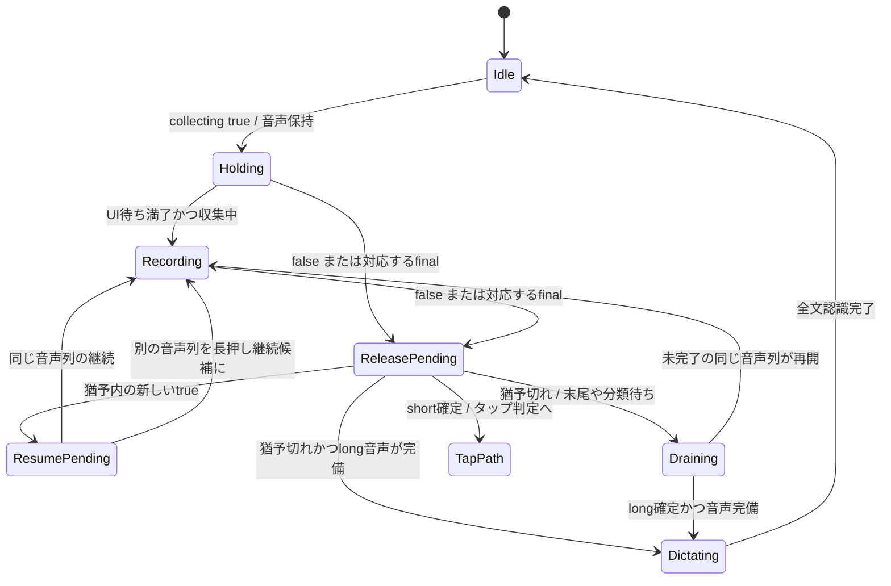
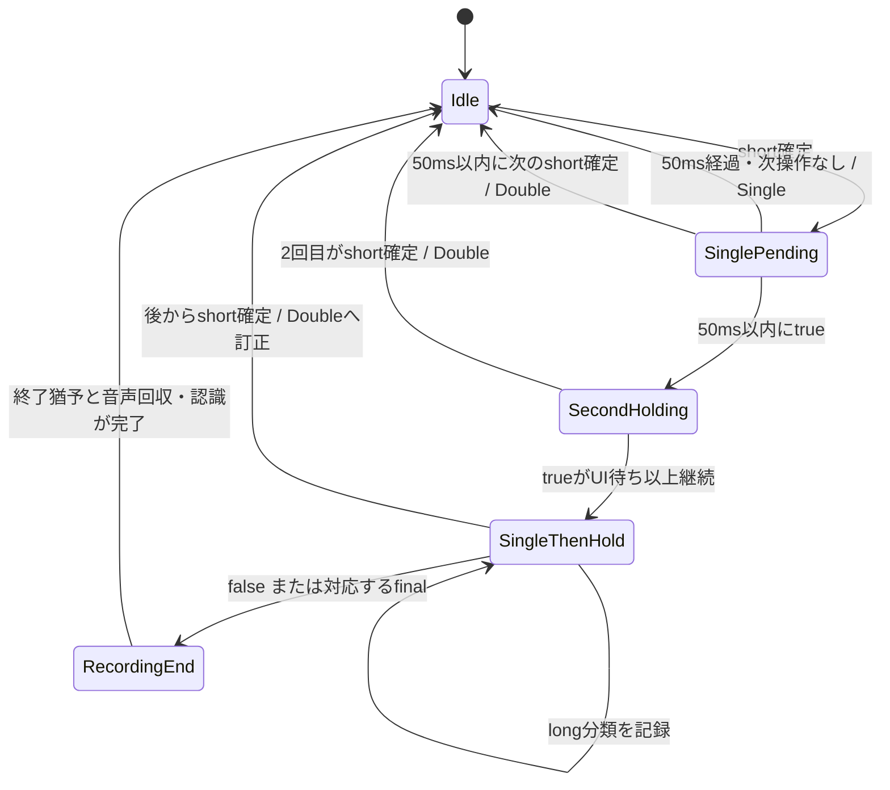
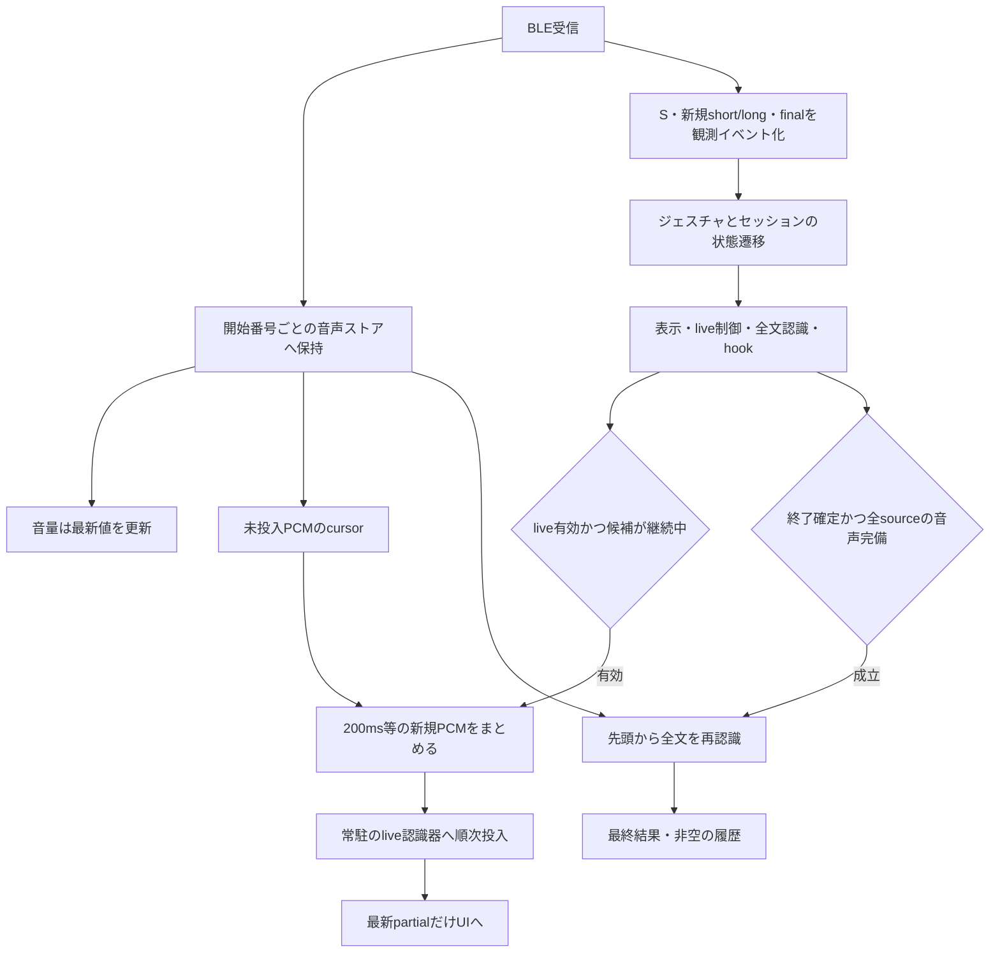
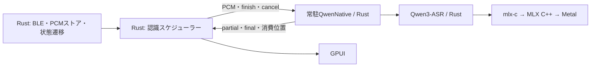

# BLE受信・ジェスチャ・録音状態の実装案

2026-10-09更新。最新の指定に合わせ、**収集中フラグで保持を開始し、50msの表示待ち・終了猶予・タップ連結を使う**案に整理した。待ち時間はMacが観測したイベントに対して適用する。

本書を受入条件として実装を進めている。依頼に合わせ、Qwenの実装・評価から着手し、その後BLE受信と状態管理を変更する。プロトコルと既存ログの根拠は [解析根拠](ble-protocol-findings.md) を参照。

現時点ではQwenのRust＋MLX推論コア、8bit重み、prefix再利用、数値・実モデルテストまで実装し、[比較結果](qwen-native-evaluation.md) を記録した。有限窓のlive制御、全文区間処理、常駐workerも実装・評価した。アプリの呼び出し・モデル検証・同梱をネイティブへ切り替えた。live優先の実行枠と停止確認、2窓の投入上限、異常時のワーカー再起動・PCM再送も実装した。BLEの音声所有・状態遷移・S/R/C選択・接続方針を接続済み。受信・認識・モデル間IPCに上限を設けた。受入条件全体の監査を続けている。アプリの再起動・ウィンドウ表示テストは行っていない。

## 1. 基本動作

1. `in_collection_state=true` で入力候補を作り、到着する音声を先頭から保持する。
2. trueが続く間は収集。50ms経過しても継続していれば録音UIを表示する。
3. live有効時は、一定量の新しいPCMが貯まるたびにバックグラウンドの認識器へ渡す。
4. falseまたはその録音のfinalで終了猶予へ。50ms以内にtrueが戻れば継続候補とする。
5. shortの確定後は50ms、次の操作を待つ。何もなければSingle、次もshortならDouble、次が長押しならSingle→録音。
6. 終了猶予が切れたらliveへの新規投入を止め、finalまでの音声が揃ってから録音全体を再認識する。

**50msの猶予と、残りのBLE音声を回収する期限は別。** falseや猶予切れの後も、その録音に属する遅配チャンクは保持する。これで末尾欠けを防ぐ。

### 調整可能な設定

| 設定案 | 初期値 | 意味 |
| --- | --- | --- |
| `hold_ui_delay_ms` | 50 | 最初のtrueから録音表示まで |
| `long_resume_grace_ms` | 50 | false/finalから長押し継続を受け付ける期間 |
| `tap_sequence_grace_ms` | 50 | short確定後に次の操作を受け付ける期間 |
| `live_chunk_ms` | 200（案） | liveへ渡す新規PCMの最低量 |
| `state_poll_interval_ms` | 50（案） | 接続中の状態確認の開始間隔 |
| `live_mode` | 既存設定 | ライブ認識の有効/無効 |

時間はそれぞれ独立に変更できるようSettingsへまとめる。既存設定に項目がなければ初期値を適用。変更は次の入力候補から反映し、進行中の候補は開始時の設定を使う。設定ファイル・既存reloadから変更できるようにし、今回新しい設定画面は必須にしない。

## 2. 状態として持つもの

### ジェスチャ状態

| 状態 | 意味 |
| --- | --- |
| `idle` | 次の操作待ち |
| `holding(prefix=none)` | 最初のtrueを観測。音声保持中 |
| `single_pending` | shortを記録済み。次の操作を50ms待つ |
| `holding(prefix=single)` | shortに続くtrueを観測。2回目がshortか長押しかを待つ |
| `release_pending` | false/finalを観測。50msの終了猶予中、または分類/末尾音声待ち |
| `resume_pending` | 猶予内にtrueが戻った。前後を長押しとして結合できるかを確認中 |

確定結果は別の `last_completed_gesture` に `single_push / double_push / long_hold / single_then_hold` とIDを保存する。Single/Doubleを発火した後、検出状態はidleへ戻るが、最後に何を検出したかは残る。

### アプリ状態と表示

アプリの公開状態は `idle / recording / dictating / error` を維持する。

- holding開始直後の50msは音声を保持するが、録音UIは非表示。
- UI待ちが満了し、同じ候補が収集中ならrecording。
- 終了猶予中の50msは表示を維持し、点滅や再表示を避ける。
- 終了が確定したらdictating。残りの音声回収と全文認識を含む。
- 認識完了後、処理中の候補がなければidle。前録音のbatch完了で、次の録音のrecording状態をidleへ戻さない。各sessionの進捗と表示対象を分け、表示中の結果や履歴も別に保持する。
- 通信復旧中は接続状態として持つ。5秒で音声を取消す処理は廃止する。

ジェスチャ状態・アプリ状態・接続状態・表示状態を1つのenumへ押し込まない。バックエンドが所有し、UIへsnapshotとして通知する。保持するID・タイマー・状態はプロセス内の状態であり、再起動時にholdingを復元しない。設定と文字起こし履歴は従来どおり永続化する。

## 3. 通常の長押し

### 開始と表示

- 最初のtrueで候補ID、開始観測時刻、UI期限を作る。以後のtrueで期限を延ばさない。
- UI期限で同じ候補の最新状態を確認する。false・short・finalが先に分かっていれば録音UIを出さない。
- 50ms経過は表示上の長押し候補。ジェスチャの確定結果はリングから来たshort/longで更新する。
- 音声取得が先行しても受信ストアに置く。UIが出る前の音声を捨てない。
- UIが出た後にshortと分かった場合は、その候補のlive結果を採用せずタップ経路へ戻す。表示待ちはこの誤表示を調整できる設定にする。

### false/finalと再開

- **falseとfinalのうち、同じ候補に対して先に観測した終了情報から50msを測る。** 繰り返しfalseや後着finalで期限を延ばさない。
- trueが戻ったら猶予内か確認する。必ず終了情報より後の新しい状態観測を使う。キャッシュに残るtrueだけで再開しない。
- longがまだ届いていない場合も、継続候補としてPCMを保持する。longを待って最初の保持・UI・liveを遅らせない。
- 同じrecord82.startのPCMは同じ音声列として保持し続ける。falseの揺れだけで分割しない。
- finalで閉じた別の音声列との結合は、猶予内の再開かつ長押し同士の場合に確定する。分類が遅れている間は別sourceのPCMを保持したまま結合候補にする。
- 再開操作がshortならそのPCMを長押しの全文へ混ぜず、前のlongを完了させ、shortをタップ経路へ渡す。
- 猶予を越えて始まる新しい音声列は別録音。前の音声列の受信・認識が終わっていなくても新しい候補を作れる。

### 猶予切れと音声完了

falseから50msで復帰しなければ表示をdictatingへ移す。ただし、finalまで届いていなければ末尾回収を続ける。**全文認識を実行できる条件は「操作の終了確定」と「所属する全音声列のfinal・欠番なし」の両方。**

未finalの同じ音声列が再び収集中になった場合は同じ録音へ戻す。これは別録音を50msで結合する処理ではなく、未完了データの回収再開。finalが欠落したまま時間だけで成功完了にはしない。

finalと音声が揃っても83の分類を対応付けられない場合は、分類不明として記録する。未確定のSingle/Doubleフックや別sourceとの結合は実行せず、音声は独立した録音として全文認識する。分類が来るまで永久にdictatingへ残したり、shortと推測して捨てたりしない。

## 4. Single / Double / Single→録音

### 判定規則

1. 新規shortは非finalで届いても分類情報として保持する。対応するfinalまで確認した時点で、その操作をshortとして記録し、single_pendingへ。録音UI・ASR結果・空履歴を作らない。
2. 50ms以内に新しいshortが来ればDoubleを即確定。追加の50msは待たない。
3. 50ms以内に新しいtrueが来ればholding(prefix=single)へ。先行Singleの確定を止め、2回目の分類を待つ。
4. 2回目のtrueが表示待ちを超えたら、Single→録音の候補としてUI/liveを始める。確定longが来たらsingle_then_hold。先行Singleのhookは実行しない。
5. 2回目がshortならDouble。2回目の押下が始まった時点で受付済みなので、その分類到着が最初のshortから50msを越えてもよい。
6. 先行shortが音声付きでも、確定したshortのPCMを録音本文へ含めない。後続の長押し音声は先頭から保持する。
7. 最初のshortでtrueを取り逃していても、short+finalの受信からsingle_pendingへ入れる。
8. 3回連続はDouble+Single、4回はDouble+Doubleとする。Tripleは今回の対象外。

Single/Doubleは既存の割当フックへ一度だけ渡す。履歴表示や貼付けなど設定済みの機能はフック側が実行する。タップを録音結果として空文字列で出したり、編集中の本文を空にしたりしない。

### 50msと受信待ちの扱い

50msは次操作の受付窓。同じ候補について、期限内にtrue/shortを観測済みなら続行する。

**期限内に次のCが存在すると分かり、まだ取得・解析中ならSingle発火を保留する。** 期限時点で既知だった取得範囲を固定し、その範囲のCを処理してDouble/Single→録音に該当するか決める。後から増えた無関係なCで待機期限を無制限に延ばさない。何もないことを確認するS/Rも既存スケジューラーの要求と共用し、専用の高速ポーリングを足さない。

タイマーと入力は1つの順序付きイベント列で扱う。期限より前に取得した入力を先に処理し、同時刻なら入力を優先。期限を過ぎ、Singleを発火済みの後に始まった操作は次の候補へ進める。

## 5. 音声の保持・live・全文認識

### 所有と所属

- rawは最初のData断片から保持し、検証後のPCMは一つのストアで所有する。ジェスチャ候補やlive/batchごとに全文コピーを作らない。
- 音声のsource IDはdevice・継続世代・record82.start。単独Cはcollection IDで管理する。
- ユーザーの論理録音sessionはsource IDのリストを持つ。50ms以内のlong再開で結合する場合も、リング由来の開始番号やfinalは書き換えない。
- チャンクが遅れて届いても、現在のholdingへ無条件に付け替えない。既に所属のあるsourceは同じsessionへ配送する。
- まだsourceの所属が決まらないPCMはストアに保持し、候補の順序と取得範囲で対応付ける。対応できない時に古い録音へ黙って混ぜない。
- finalが先に分かっても、途中Cが欠けていれば回収を続ける。PCMが空のfinalも処理する。
- 受信ストア・未処理件数には上限を設定し、枯渇時は明示エラーにする。音声を黙って切り詰めない。通常時に音声ファイルは保存しない。

### liveの動かし方

- 既存のliveオプションが有効なら、一定量の**新規PCM**を常駐認識器へ渡す。200msごとに録音全体を別タスクで再認識する方式にはしない。
- 同じ録音のlive処理は1本。BLE受信側はASR完了を待たず、ジョブの無制限な複製を避けてcursorで消費位置を管理する。
- UI表示前にpartialが出ても、それを理由に窓を表示しない。
- 猶予中はliveセッションを維持し、猶予内のlong再開でモデル初期化をやり直さない。
- 分類待ちの再開候補のlive文字は暫定結果。後からshortと確定した分は全文対象から除外する。モデルへ投入済みなら、誤った文脈を引き継がないよう残す長押しPCMからliveを再構築する。
- 終了確定後は新しいlive投入を止める。残りのBLE音声は全文ストアへ回収し、全文認識へ渡す。
- 最後の200ms未満の端数も全文へ含める。liveを正常flushする場合は端数を待たず渡す。liveの滞留を全て消化するまで全文認識の登録を待たない。
- ASRの入力ACKと実際の消費位置を分けて記録する。モデル内部のバッファ時間はアダプター側でも扱う。現在のQwenの1秒設定を、ホストの200ms分割だけで短縮したことにはしない。
- live無効でも音声保持・音量表示・最後の全文認識は実行する。
- 次の録音が始まったらliveを優先し、前録音のbatchは処理単位の境界で譲る。最終結果のID/revisionで古いpartialの上書きを防ぐ。

## 6. 検出・状態・処理の責務

| 層 | 担当 | 行うこと |
| --- | --- | --- |
| 取得 | `capture.rs / bluetooth.rs` | S/R/Cを取得。取得時刻・順序を付けて配送 |
| データ保持 | `recordings.rs` | 1回のTLV解析、PCM保持、sourceの順序・final・欠番管理 |
| 観測の正規化 | `button_detector.rs` | Sの観測、83の新規要素、対応するfinal、期限の材料を通知 |
| 純粋な状態遷移 | `session_state.rs` | 現在状態＋観測＋時刻→次状態と命令。PCMやUIを直接触らない |
| 効果の実行 | `input_effects.rs / interaction.rs` | 命令からUI通知・ASR制御・hookを実行 |
| 認識 | `recognition.rs / speech adapters` | live/batchと結果通知 |
| 表示 | `overlay` | snapshotと文字列を描画。独自の押下判定・終了タイマーを持たない |

状態snapshotには `session_id, gesture_state, prefix, last_completed_gesture, app_state, collecting, ui_deadline, resume_deadline, tap_deadline, generation` を含める。期限そのものはバックエンドで管理し、UIは再計算しない。

83は全snapshotから既出prefix・再送を除いた新規要素を通知する。**過去のshortが残る長押し音声を、末尾shortだけで短押しへ分類し直さない。** 非finalのCで新規short/longが分かった場合は分類情報を先に記録し、音声の完了はそのsourceのfinalを待つ。long分類だけでは録音を終了させない。履歴reset等で新旧を対応できない場合は判定理由をログに残し、音声保持を止めない。

## 7. 受信スケジューラー

今回の方針ではSが開始検出に必要。接続中はSを監視し、収集中フラグと件数を同時に読む。

- 未取得Cが分かっている時は順に回収する。
- 状態確認の期限が来た場合は、現在のREAD完了後にSを読む。UI/再開/Single判定用の確認もこのSと共用する。
- 件数変化、既知範囲の回収完了、周回確認時にRを読む。S/Rの重複要求をまとめる。
- 各Cの後に無条件でsleepやR/S一式を追加しない。次の要求は1つのスケジューラーが期限と未取得範囲から選ぶ。
- ワイヤー応答に要求IDがないため同時READは1件。C受信中に50ms期限が来てもREADを途中で混線させない。遅れは `deadline_lateness_ms` に記録する。
- 状態確認の開始周期は50msを評価値とする。転送時間が超えたら余分なsleepや追いつくための要求連打を加えない。

転送中のREADがない理想条件では、状態変化の観測待ちは0〜P ms、録音UIまではこれに表示待ち50msを加える（P=50なら50〜100ms、BLE往復・OSの実行待ちを除く）。C受信が進行中なら、その残り時間も加わる。50ms設定を操作から表示までの遅延保証として扱わない。Singleの追加待ちはshort+finalを処理した後の50msであり、既知の次Cを待つ時間は別途記録する。

P=50msは待機中だけで最大20回/秒・72,000回/時のS要求になる評価値。現在のGUIの20ms設定より要求数を抑えるが、スマホ相当の消費電力とは断定しない。モバイル側の固定READ周期は解析資料から確定できておらず、スキャン再開の3秒をポーリング間隔として引用しない。電池評価を通して既定値を決める。

調整対象はSの周期だけでなく、余分な要求、二重解析、バッファ複製、ASR待ち、古いタイマー。50ms設定の電池効果は未測定なので、READ数・接続時間・電池推移と一緒に評価する。

既存の接続方針は維持する。未操作1時間、または未接続/通信障害が1分継続したら広告待ち。広告再出現・Mac復帰・離席後の操作再開で先行接続し、同じ広告による再試行の連打を避ける。接続失敗の段階・OSエラー・復旧時間をログに残す。

起動時は古い完成音声をskipし、進行中のsourceを保護する。通信再接続では起動flushを行わず、既存ストアとcursorを維持する。

## 8. タイマー競合と例外のレビュー

| ケース | 必要な動作 |
| --- | --- |
| true→30msでfalse→short final | 録音UIなし。short確定からSingle待ち |
| true→50ms継続 | 録音UI。short/longの確定待ちでPCMを捨てない |
| short→30msで次のshort | Doubleを一度発火。Singleは発火しない |
| short→30msでtrue→その後short | Singleを保留し、Doubleへ |
| short→30msでtrue→長押し | Single→録音。先頭shortの音声を本文へ混ぜない |
| false→30msでtrue、同じsource | 収集・UI/liveを継続 |
| long final→30msでtrue→次もlong | 同じ論理録音へ結合。sourceとfinalは各々保持 |
| long final→30msでtrue→次はshort | 前のlongを完了。次のshortは別のタップ |
| falseから50ms経過、final未到着 | dictatingで末尾回収。音声欠落や見せかけの全文完了にしない |
| false→遅れて同じsourceが再開 | 未完了の同じ音声列を二重作成せず復帰 |
| false後にfinalが遅配 | 最初の終了猶予を延ばさない。ただしshortの連結待ちはshort確定から開始 |
| 古い録音のfinalが新しいholding中に到着 | source/session IDで旧録音に適用。新録音を閉じない |
| final時点で直前のSがtrueのまま | そのキャッシュ値では再開しない。終了後の新しい観測を使う |
| Single期限前に次のCが既知だが未解析 | 解析を待って分類。タイマーだけでSingleを先行発火しない |
| Sを取り逃したがshort finalが届く | shortメタデータからSingle/Double経路へ入る |
| Sを取り逃して完成long音声が届く | 保持済み全文を処理。終了済みの録音中UIを一瞬出さない |
| 非finalでlong、その後finalにshort履歴もある | 既出要素を除外。既存long音声をshortへ変更しない |
| BLE断→復旧 | 断をfalseに変換しない。音声を保持し、古い5秒Cancelは実行しない |
| UIをEsc/外側クリックで閉じる | 収集/認識は継続。同じ録音のpartialで勝手に再表示しない |
| 手動編集・IME中にpartial | 編集revisionを守る。本文を進捗文字や空文字へ戻さない |
| 前録音のbatch完了時に次録音が収集中 | 前の結果だけ更新し、次録音のrecordingを維持 |
| 設定をholding中に変更 | 現候補は開始時設定、次候補から新設定 |
| finalとタイマーが同時 | 取得時刻・順序で入力を先に処理し、世代が古い期限を無効化 |

時間判定は単調時計を使用。trueの反復、重複final、古いタイマーで候補を再生成しない。起動前の履歴や再送から同じSingle/Doubleを再発火しない。

## 9. 実装の順序

1. **イベントと状態の契約**：設定3種の50ms、prefix付きholding、Single待ち、長押し再開候補、last_completed_gestureを定義する。
2. **音声所有を分離**：sourceごとの保持と論理sessionの参照を作り、captureなし/Error中のPCM破棄と現在のpress-IDへの無条件付け替えを除去する。
3. **純粋な遷移器へ集約**：UI/再開/タップ待ちを1か所で処理。unmatched_edges、末尾bitだけの分類、150ms未満だからshortという処理、古い5秒Cancelを除去する。
4. **受信・認識の待ちを分離**：S/R/Cスケジューリング、1回の解析、live cursor、全文ジョブと表示世代を接続する。
5. **境界ケースを確認**：第8節の観測列と既存ログを用いて状態・出力を確認してから実機評価する。既存GPUI、入力/認識アダプター、IME、履歴、バックエンド貼付けを維持する。

`--log` は全診断、`-v` はコンソール詳細。ログには各観測、候補/source/session ID、状態遷移、期限と遅れ、gesture発火、保持/消費PCM量を残す。本段階ではアプリの実行や表示テストは行わない。

### 状態・PCM契約の実装状況

`src/reception/` に機器やUIに依存しない実装を追加した。

- `config.rs`: 独立した待ち時間の初期値・検証。Settingsの `reception` へ保存し、候補作成時にコピーする。
- `button_detector.rs`: 83のprefix差分と分類根拠。再送・履歴reset・対応できない履歴を新しい押下として推測しない。
- `session_state.rs`: sourceの所属、短押し連結、UI/終了猶予、長押し再開、snapshot、全文認識の開始条件。取得済み範囲の固定watermarkでSingleを保留する。
- `input_effects.rs`: 状態から独立したPCM投入計画。200ms等の未投入分だけを共有参照で渡す。確定shortの除外後は投入済みの範囲を確認してliveを再構築し、全文はfinal・欠番なしを再確認して作る。
- `src/pcm.rs`: 不変ブロックの共有と範囲参照。cursorの先頭を二分探索し、録音の先頭から毎回全ブロックを走査しない。

**入力経路への接続まで実装した。** `adapters/input/index.rs` と `interaction.rs` が受信ストア・状態機械・効果を接続する。旧エッジ検出器、150msでの音声破棄、5秒Cancelを削除した。受信プロセスの取得時刻・sequence・clockを同じFIFOで配送し、認識側のwall-clockで入力を追い越さない。liveジョブの世代と表示許可を録音IDごとに照合し、古いpartialを無効化する。

`tests/reception_pipeline.rs` は合成リングTLVを実際の認識制御プロセスとmock ASRへ通す。連続録音、タップの再送、未解析Cを待つDouble、欠番の後に届くshort final、切断から復旧した全音声の保持を確認する。BLE・マイク・GUIを起動しない。

S/R/C要求の選択も `reception/scheduler.rs` へ統合した。Cサイズ依存の分岐と別々の待機ループは削除。SのREADが周期を超える場合は、R/Cを一件進めて音声回収を止めない。要求期限の超過、S/R/C別要求数・失敗数・所要時間、接続時間をログに残す。Sの件数変化が先行した場合はRの確定までSingleを保留し、範囲確定後は後続の別Cで待ちを延ばさない。合成時計と合成TLVのIPCで確認し、実機の速度や電池消費の改善はまだ測定していない。

接続方針は `reception/connection.rs` へ分離した。未操作1時間または連続した通信障害1分で広告待ちに入り、広告の変化・再出現とMac復帰を接続ヒントにする。同じ広告を反復受信しても再接続を連打しない。障害後だけ30秒間隔の復旧確認を許可する。通信が進むまで障害時刻を保持し、段階・OSエラー・復旧時間を記録する。Swiftの広告フィルターも合成入力で検証する。

ASR障害時の再起動・再送は `recognition/recovery.rs` に接続した。故障したモデルだけを再起動し、共有PCMのjournalと未完了ジョブを保持する。新モデルは録音の先頭から再構築し、古いlive世代と受領済みfinalを再表示しない。`RestartableControl` で旧モデル終了後に実行許可を付け替える。合成IPCと実Qwenの障害注入で確認した。

`src/ipc.rs` に件数・保持量を制限する非同期FIFOと、途中でselectを中断しても部分行を失わないJSONL readerを追加した。BLE/source→認識制御、live/batchジョブ、helper結果と認識結果の各キューは4,096件・256MiB相当まで。送信で空き待ちはせず、超過時は専用のエラー欄で失敗を通知する。PCMは範囲の長さだけでなく、参照が保持する元の確保量とブロックを数える。進行中の通常PCM入力も64Miサンプル・16,384ブロック・128録音に制限した。

JSONLは16MiB/行。診断ログは256KiBずつ分けて読み、長いログを理由にモデルを失敗させない。ファイル入力は1MiBのPCMごとに送信し、最後だけfinalにする。モデルの停止ACKは、結果をキューへ入れる前に独立したobserverで処理する。容量不足や不正な巨大フレームは最終結果・保存位置の成功通知に変換しない。過負荷で処理全体を終了した場合、メモリ上だけの録音をプロセス再起動後に復元する仕組みはない。

`tests/ipc_limits.rs` とIPC/helper単体テストは、キュー満杯、ACK監視、途中行のキャンセル、改行のない巨大入力、1フレームを超えるファイルの全バイト到達を確認する。GUIのイベントキュー・webhookの受付キューは今回のIPC変更対象外で、受入条件監査で別途扱う。

受入監査で、R.startの前へ消えたCが解析watermarkを止め、後続のSingle待機が解除されなくなる経路を修正した。検証済みCの取得位置とsourceの連続PCM位置を分け、明示した欠落より先のイベントは処理する。欠落したsourceはfailedのまま保持し、全文認識へ成功として送らない。起動前sourceを読み飛ばした場合も解析watermarkに穴を残さない。通常の順不同Cは欠番が届くまで待つ。

正常EOFは暗黙のflushとして扱う。届いているfinalまでの認識を待ち、入力側の認識完了ACKから発生するretire/checkpointも処理してから`flushed`を返す。その後ジョブの送信口を閉じ、live/batchそれぞれがモデルstdinを閉じて終了するまで待つ。finalが欠けているEOFはエラーにし、全文結果や`flushed`を捏造しない。helper終了の3秒期限にはstdin lock待ちも含め、詰まった送信が強制終了を妨げないようにした。合成IPCで全500サンプル、保存位置、2モデルのEOFを照合した。

### 受入監査メモ（実装継続中）

| 範囲 | 確認済みの根拠 | 残る確認 |
| --- | --- | --- |
| 第1〜4節の50ms・short/long・結合・表示世代 | `session_state_tests.rs`、純粋な表示モデル、合成TLVのIPC | ファームウェアの83 reset・飽和条件は未確定。対応不明を新しい押下と断定しない |
| PCMの保持・欠番・live cursor・全文範囲 | `recordings.rs`、`input_effects.rs`、`pcm.rs`、`reception_pipeline.rs` | リングのcounter巻き戻り／リセット時の扱いと、復旧不能sourceの後続Cを監査する |
| S/R/C・接続期間・広告ヒント | 合成時計のscheduler/connectionテスト、Swift広告フィルターテスト | Bluetooth helper起動時の電源OFF・helperプロセス終了の復旧経路を監査する |
| Qwen native・有限窓・停止ACK・再送 | 固定重みの数値比較、実モデル比較、live/batch障害注入 | 実際のBLE・UIを含む総遅延は未測定 |
| IPC上限・部分行・ファイル分割 | `ipc.rs`、helper単体、`ipc_limits.rs` | GUI/Webhookの従来キューは変更対象外。EOFは全文・保存位置・モデルの正常終了を待つよう修正し、IPCで確認済み |

この時点の画面なしテストは218件通過、4件は通常実行ではignored。実Qwenの独立したlive/batch復旧テストを別途1件実行して通過。Clippyは警告なし。実機の接続維持・復帰時間・電池消費の測定、既存UIの起動や再起動は行っていない。

状態機械の観測列テストは `src/reception/session_state_tests.rs` に置く。UIなしで再実行する場合は `cargo test --release --lib reception::`。Esc・編集・履歴を扱う既存表示モデルの確認は `cargo test --release --bin index-voice` の純粋なモデルテストを使い、ウィンドウは生成しない。

## 10. QwenをPythonなしで実行する案

### 現在の呼び出し

移行前はRust → 専用Pythonプロセス → `mlx-qwen3-asr 0.4.4` → MLX/Metal。Pythonは起動用ラッパーだけでなく、音声前処理・モデル構築・逐次認識の制御も実行している。

- 移行前の `process.rs` は `.venv/bin/python -u -c ...` で埋込Python adapterを起動していた。現在は `QwenNative` を起動する。
- 移行前のセットアップと準備判定はuv/Pythonに依存していた。現在の [qwen_setup.rs](../src/qwen_setup.rs) は固定モデルを取得・SHA-256検証し、[qwen_runtime.rs](../src/qwen_runtime.rs) は対応manifestと実行ファイル・Metalリソースを確認する。
- 採用モデルは `moona3k/mlx-qwen3-asr-1.7b-8bit`、revision `22c8abe6a6772122dda5905967d7496d1d3e8dd2`。
- 現在のliveは1秒チャンク、最大30秒窓、prefix再利用と無音付近での確定を使用。入力200ms化と推論窓1秒化は別の設定として扱う。

### 調査結果と選択

**Rustから直接実行することは可能。第一案は、RustでQwenの推論を行い、MLX C API経由でMetalを使う常駐ASRワーカーとする。** 現行のMLX・1.7B・8bitを維持できるよう必要な機能を移植する。既存crateを差すだけで現在と同じ動作になる状態ではない。

調査は2026-10-09時点のソース確認。以下の候補をビルド・速度測定した結果ではない。

| 候補 | 確認できた機能 | 今回必要な追加作業・判断 |
| --- | --- | --- |
| Rust＋MLX：second-state/qwen3_asr_rs | RustでQwenモデルを実装し、mlx-cからMetalを利用。Apache-2.0 | 調査版はファイル入力のbatchが中心。現在の8bit重み、逐次PCM、有限窓、キャンセルを追加する。MLXを維持する第一案 |
| Rust＋Candle：alan890104/qwen3-asr-rs | `transcribe_samples / feed_audio / finish_streaming`、Metal対応。MIT | 直接リンク可能。ただし現行MLXのpacked 8bitを読む実装は確認できず、全蓄積PCMのmel計算・decoder入力が伸びる。量子化対応と窓制限が必要。MLXからの変更も伴うため第二候補 |
| Swift＋MLX：Blaizzy/mlx-audio-swift | Qwen 1.7B/8bit、`StreamingInferenceSession.feedAudio / stop / cancel`、窓ごとの逐次処理。MIT | コンパイル済みhelperとして利用可能。現在の重みとの互換修正、日本語の窓結合、依存範囲の整理が必要。Rust経路が受入条件を満たせない場合の代替案 |

根拠：Rust＋MLXの [推論コード](https://github.com/second-state/qwen3_asr_rs/blob/3fa673441682350b12da5c21429fea71ce212023/src/inference.rs) と [MLX呼出し](https://github.com/second-state/qwen3_asr_rs/blob/3fa673441682350b12da5c21429fea71ce212023/src/backend/mlx/ops.rs)、Candle版の [モデル読込](https://github.com/alan890104/qwen3-asr-rs/blob/c5ef09646af6278d2ba8b8ceaf543ffb32d1a5dc/src/inference.rs) と [逐次処理](https://github.com/alan890104/qwen3-asr-rs/blob/c5ef09646af6278d2ba8b8ceaf543ffb32d1a5dc/src/streaming.rs)、Swift版の [Qwenモデル](https://github.com/Blaizzy/mlx-audio-swift/blob/dbe5eaac964e8257785f9d015c81f819a38016a8/Sources/MLXAudioSTT/Models/Qwen3ASR/Qwen3ASR.swift) と [逐次PCM処理](https://github.com/Blaizzy/mlx-audio-swift/blob/dbe5eaac964e8257785f9d015c81f819a38016a8/Sources/MLXAudioSTT/Streaming/StreamingInferenceSession.swift)。

Candle版はencoderの完了窓を再利用するが、`audio_accum` が増え続ける。単にRustへ交換しても、長時間録音の遅延増大を防ぐ設計にはならない。一方、Swift版の `generateStream(audio:)` は用意済み音声に対するトークン出力であり、今回必要な逐次PCM入力には上表の別APIを使う。

### Rust＋MLXで実装する範囲

推論部分は `src/qwen/` に置き、ルートのCargoパッケージの追加binとして `src/bin/qwen_native.rs` から `QwenNative` を作る。別Cargoプロジェクトは作らない。Rustのワーカー内でライブラリを直接呼び出す。BLE・状態遷移を持つプロセスとは分け、GPUIへ推論を組み込まない。

1. **必要な推論コアだけを取り込む。** second-state版のモデル層・前処理・MLXラッパーを固定revisionで取り込み、Apache表記を維持する。Python・libtorch・HTTPサーバー・ファイル音声デコーダーを実行依存に含めない。必要なRust依存とMLX/C API、Appleのframeworkに絞る。ビルドにはCMakeとXcodeのMetal toolchainが必要。
2. **現在の8bit重みを直接読む。** `quantization_config.json` のbits=8/group_size=64と、各層のpacked weight/scales/biasesに対応する。LinearだけでなくEmbedding・audio encoder・出力層の量子化有無を検査する。MLXの [C API](https://github.com/ml-explore/mlx-c/blob/main/mlx/c/ops.h) に量子化演算があるため、演算カーネルをRustで作り直す必要はない。MLXとmlx-cの対応revisionを一緒に固定し、FFIの戻り値とオブジェクト寿命を検査する。
3. **日本語の前処理を揃える。** 16kHzへの位相連続リサンプル、mel/STFT、tokenizer、Japanese指定、特殊トークン除去、発声開始ゲートを移植する。初期化用の無音結果を表示しない。短押し判断は入力状態機械に置き、ASR内で録音を勝手に切らない。
4. **有限窓でliveを動かす。** 現行の最大30秒窓・確定prefix・末尾の再推定・確定encoder窓の再利用を移植する。過去の全文字列は保持するが、全録音を毎回再エンコードしない。ホストPCM投入量と認識の実行間隔を独立設定にし、重複ジョブを作らない。
5. **全文認識は全区間を覆う。** 長い録音は音声境界付近で区切って順次処理し、先頭から末尾までの区間・結果を保持する。窓境界の重複除去はtoken/対応区間に基づけ、日本語を空白分割しない。トークン上限到達を成功finalとして扱わない。
6. **重みは常駐、録音状態は毎回初期化。** final/cancel後はPCM cursor・resampler・窓・KV cache・prefix・世代をリセットし、重みだけ再利用する。別録音の本文を次の初期prefixへ渡さない。

第一案もC++のMLXをリンクするため、「全てRustだけの実装」ではなく「PythonなしでRustからネイティブ推論を呼ぶ実装」である。最初からモデル・カーネル全体を再実装する計画にはしない。

### プロセス・IPC・負荷制御

- 既存 `SpeechEngine` の `audio / finish / cancel` と `ready / accepted / partial / final / error` を維持する。JSONL＋base64 PCMは初期移行で共用する。プロトコルversionと `session_id / generation / consumed_samples` を追加し、旧外部アダプターは既存方式で扱う。
- stdin受信と推論は別の実行経路にする。`accepted` は受信確認、`consumed_samples` は認識へ反映済みの位置。親の音声ストアを正本とし、未受領PCMはcursorで再送できるようにする。
- live/batchのワーカーは常駐させる。新しい録音のliveを優先し、batchはencoder窓・生成tokenの区切りで停止/再開できるようにする。同じGPU上で実行が競合するため、プロセス分離だけで優先度が保証されるとは扱わず、親の認識スケジューラーから実行枠を割り当てる。
- cancelは世代を即更新して古い結果を無効化する。GPU処理の終了は計算単位の境界で待つ。未完了処理と次録音で可変cacheを共有しない。
- 終了時はstdinをdropしてEOFを送り、正常終了を待つ。ハング時だけ対象workerを終了して再起動する。BLE受信と保持済み音声は維持する。
- 実行ファイルと必要なMLXライブラリ・Metalリソースをapp bundleへ同梱する。動作に必要なリソースを含めて配置確認し、録音ごとにプロセス起動・モデル読込・コンパイルをしない。

### Swiftバイナリを使う場合

Rust経路の移植量・速度・精度が受入条件に届かなければ、`QwenNative` と同じIPCを持つSwiftバイナリへ差し替えられる。入力・状態機械・UIの変更は不要にする。

ただし、Swift版でも現在のモデルをそのまま読めるとは言わない。手元の重みヘッダーにはaudio encoderの量子化scalesが147個あり、量子化設定は別ファイルにある。確認したSwift loaderはconfig内の量子化設定を読み、audio towerを量子化対象から除外している。**現在の重みを使うにはloaderの追加対応が必要。** 名前が同じ1.7B/8bitという理由で別のcheckpointへ黙って交換しない。

また、Swift側の窓結合には空白単位の重複除去があるため、日本語の対応区間/tokenに沿う実装へ修正する。依存は [Package.swift](https://github.com/Blaizzy/mlx-audio-swift/blob/dbe5eaac964e8257785f9d015c81f819a38016a8/Package.swift) でMLX・MLX LM・tokenizer・Hubなどに広がる。必要なQwen/STT部分の切り出しとライセンス表記を行い、「Swiftなら依存なし」とはしない。

### 切替手順と受入条件

1. 第1〜9節の受信・状態・音声所有の境界を先に整理し、現行Qwenの指標を分離して採れるようにする。
2. ネイティブ版で現在のモデル・同じPCMを読めるようにする。最初にbatchの前処理・tokenizer・全文結果を比較し、その後live・cancel・連続録音を接続する。
3. 日本語の長音声、無音、短押し、窓を跨ぐ録音、2回目以降、live中に前録音のbatchが走る条件を比較する。確認項目は初回partial、最新音声に対する認識の遅れ、終了後finalまで、RTF、メモリ、欠落/重複、日本語CER。遅れが録音時間とともに増え続けないことを切替条件にする。
4. `ProcessEngine` のQwen起動先をネイティブworkerへ変更。`setup-qwen` はRustによるモデル取得・固定revision/SHA-256検査だけにし、準備判定を「バイナリ＋対応モデルmanifest」に変更する。Python/uvの実行経路と埋込adapterを削除し、READMEと同梱ライセンスを更新する。
5. 既存モデルは再利用し、旧venvは参照しない。移行のためにユーザーのモデルや環境を無断削除しない。表示上の選択肢はSpeechAnalyzer / On Deviceのまま。

**Pythonを外しただけで高速化するとは約束しない。** 現在も重い行列演算はMLX/Metalで動いている。改善対象は配布依存に加え、推論の窓、不要な再計算、待ち行列、liveとbatchのGPU競合。ネイティブ化と受信改善の効果を別々に測る。
